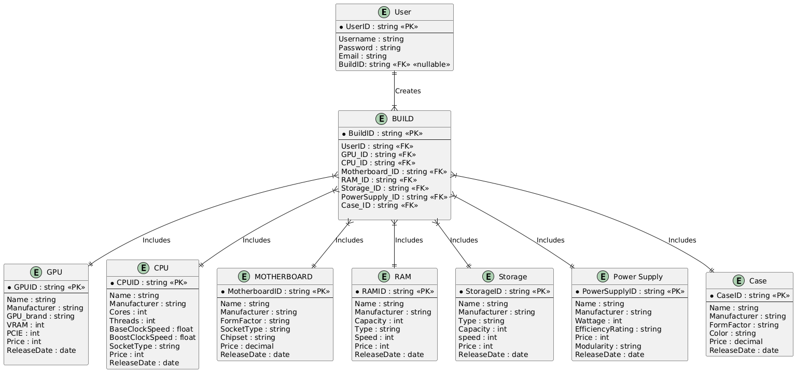
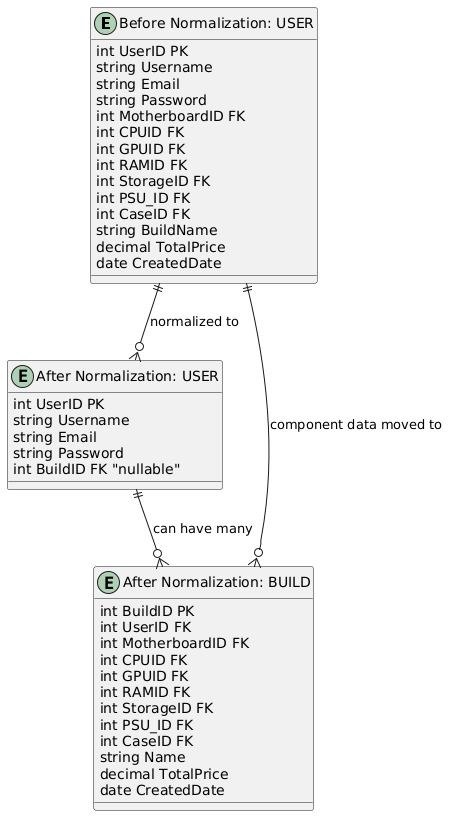

### name: Kwadwo Osarfo-Akoto

# PCPARTPICKER
## Description:
This program allows users to select computer parts for building a PC showing using a databases to store different parts and their prices. The program allows users to select parts based on their preferences and budget, and overall specifications. 

## Entities:
- **User**: User will be the main way of interacting with the program in terms of adding parts to their list and and managing overall price. 
- **GPU**: Graphics Processing Unit, responsible for rendering images and video. Integral for gaming and graphic-intensive applications.
- **CPU**: Central Processing Unit, the brain of the computer that performs calculations and processes data.
- **Motherboard**: The main circuit board that connects all components of the computer, allowing communication between them.
- **RAM**: Random Access Memory, temporary storage that allows the CPU to access data quickly for running applications.
- **Storage**: Hard drives or SSDs that store the operating system, applications, and user data.
- **Power Supply**: Converts electrical power from an outlet into usable power for the computer's components.
- **Case**: The enclosure that houses all the computer components, providing protection and cooling.
- **Build**: A collection of selected parts that make up a complete PC configuration. Users can create multiple builds, each consisting of various parts.

## Tech Stack:
- **Programming Language**: Python, HTML5, SQL
- **Database**: SQLite (for storing parts and user selections)
- **GUI**: flask (for web-based interface)
- **Libraries**: 
    - sqlite3 (for database interactions)
    - SQLAlchemy
    - Flask
    - login-manager (for user authentication)
## Interactions:
**User Registration/Login**: Users can register and login to the application. this will add a new user to the database and allow them to save their builds. When a users is done, they can log out and return to the login screen.

**Build CRUD**: Users can create a new build by selecting parts from the database. Users can add multiple builds to their account and even edit parts of their builds. Along with that users can delete builds they no longer want to keep. Builds give the total cost of the entire build based on msrp to give users a rough idea of the total cost of their build.

### Use of AI:
Due to the large amount of parts and specifications, Claude and ChatGPT were used ot generate the data sets to be implemented in the database. Specifically Claude and ChatGPT was used to research and generate the data for the GPU, CPU, Motherboard, RAM, Storage, Power Supply, and Case tables. This data was then used to populate the database with part information, Which otherwise would have taken extensive time to produce by hand, due to how much data was needed some of the data may not be accurate to current markets and up-to-date prices.

## ER-Diagram:
The ER diagram below shows the relationships between the entities in the PCPicker application. The User entity is connected to the Build entity, which in turn is connected to the Parts entities. This structure allows users to have multiple builds, and each build can consist of multiple parts.


## BCNF Normalization:
the initial schema had it so where user entity contained all the foreign keys to all the parts. This created a couple of problems in which the user table became redundant, along with that this format only made it possible for users to have only one build.The normalization process involved taking the foreign keys of each individual part for the build and creating a new table called Build in which all the foreign keys would be stored and build would reference User to show ownership of each build made. This was done to remove the redundancy and allow users to have multiple builds and also make it easier to delete, edit and even compare prices of each build a user has made. The new schema as shown above has a user table, a table for each part, and a Build table.


## Relational Schema:
- user(user_id, username, email, password)
- gpu(gpu_id, name, manufacturer, gpu_brand, vram, vram_type, price, pcie, release_date)
- cpu(cpu_id, name, manufacturer, cores, threads, base_clock_speed, boost_clock_speed, socket_type, tdp, price, release_date)
- motherboard(motherboard_id, name, manufacturer, form_factor, socket_type, chipset, ram_compatibility, ram_slots, price, release_date)
- ram(ram_id, name, manufacturer, capacity, type, speed, price, release_date)
- storage(storage_id, name, manufacturer, type, capacity, speed, price, release_date)
- power_supply(psu_id, name, manufacturer, wattage, efficiency_rating, modular, price, release_date)
- case(case_id, name, manufacturer, form_factor, color, price, release_date)
- build(build_id, user_id, gpu_id, cpu_id, motherboard_id, ram_id, storage_id, psu_id, case_id, total_price, created_date)
## Installation:
To run the PARTPICKER application, you will need to have Python installed on your machine. You can download Python from [python.org](https://www.python.org/downloads/).

Once you have Python installed, you can clone the repository or download the source code to your favorite IDE or development environment (e.g., Pycharm, VsCode). After that, navigate to the project directory in your terminal or command prompt.
install the required packages using pip:
```
pip install flask 
pip install flask_sqlalchemy
pip install flask_login
```
To run the program, first go to and run the file.You only really need to do this the first time you run the program, subsequent runs can be done from main.py . the flask server should start running on port 5000, click on the link in the terminal window to open the web application in your browser.

## Navigation:
when you first open the application, you will be greeted with the login screen. If you do not have an account, you can create one by clicking on the "Register" button. Users are not allowed to access the home page or any of the builds until they log in or register. Once you are logged in, you will be able to see your builds and create new builds with different parts. You can also edit and delete your builds as needed. At any time users can click the home button to return to the home page. From there you can also view the list of available manufacturers.

## Security and Authentication:
The application uses Flask-Login for user authentication. Passwords are hashed using Werkzeug's security features to ensure secure storage. Users must log in to access their builds, and session management is handled by Flask-Login. Along users will not have to log in every time they open the site, the application remembers the user session until they log out.

## Conclusion:
This was a fun project to work on in which I was able to further my knowledge on web based application. For this project specifically I used python for both the front and back end. In the future I might want to experiment with this a little more and try to implement a more complex front end using React or Vue.js. Overall this project was a great way to learn about web development and how to create a functional application involving databases and sql query language. 

